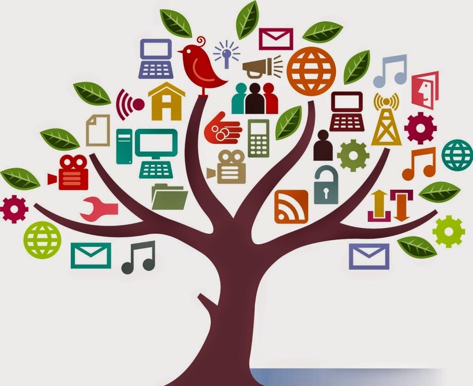

# EasyBuy

> Sistema destinado para compras em diversos estabelecimentos pelo aplicativo!

## 2. Sinopse

O projeto tem como propósito a diminuição da perca de tempo em filas de supermercados e aumento de receitas para pequenas e médias empresas.
O **EasyBuy** é uma ferramenta capaz de realizar compras em mercados próximo a sua localização e no mercado a sua escolha, para que o cliente tenha controle total de suas decisões diante a compra. Em parte de empresa o aplicativo irá auxiliar na venda de seus produtos a partir do aplicativo, podendo escolher quais são seus produtos disponíveis para vendas, raio de entrega e formas de pagamentos com isso poderá ter uma expansão no seu rendimento visto que agora o seu estabelecimento estará fazendo parte do marketing espontâneo. Todos os supermercados serão ranqueados para fornecer ao cliente a melhor escolha na hora da compra e servirá para o empresário como feedback.
O tempo para desenvolvimento será de 1 ano
Quanto: Serão necessário 5 pessoas, computadores e internet e 30 Dólares mensais para servidores.
Sumário dos aspectos relevantes do projeto. Por que (propósito), o quê (descrição do produto / escopo), quando (tempo) e quanto (recursos).

## 3. Descrição, Produtos e Entregas

O EasyBuy terá dois aplicativos um mobile e outro Web, para o aplicativo mobile será desenvolvido uma ferramenta para o cliente final(comprador) onde ele poderá realizar suas compras, o aplicativo comprador contará com:

* Tela de login
* Tela esqueci senha
* Cadastro do cliente
* Meus dados
* Tela inicial com os mercados próximo ao comprador
* Tela para cadastro de lista de produtos
* Tela de cadastro de formas de pagamento
* Lista selecionável com os produtos do supermercado selecionado
* Detalhe do produto
* Integração com o PagSeguro
* Carrinho.
* Processamento de pedidos.
* Página de pagamento
* Tela de confirmação de pagamento
* Tela com pedidos realizados
* Tela detalhe de pedidos
* Pedido autorizado

### Tela de login

A tela de login será exibida com a logo no fundo e campos de usuário e senha para inserir as informações e links para cadastro e esqueci senha.

### Tela de esqueci senha

Será uma tela onde o usuário digitará seu e-mail e submeterá o formulário e logo em seguida receberá um e-mail com uma nova senha.

### Tela de cadastro de cliente

Essa tela terá campos com para: Nome, Sobrenome, Endereço e Forma de pagamento padrão.

### Página Inicial

Uma tela com os mercados próximos da sua localização atual, será exibido no Google Maps com ponteiros customizados, um campo para pesquisar por endereço e se o GPS estiver desligado pesquisar pelo o endereço do usuário logado.

### Cadastro de lista de produtos

Uma tela onde o cliente poderá criar uma lista de produtos para realizar compras rápidas. Os produtos carregados serão os cadastrados pelo os estabelecimentos. O cliente poderá ter N listas cada um com um identificador único por usuário em texto.

### Cadastro forma de pagamento

Uma tela onde o cliente poderá selecionar a forma de pagamento que deseja salvar para as compras. Inicialmente as formas de pagamentos serão dinheiro e cartão (Crédito e Débito). Os cartões serão únicos para cada cliente. 

### Selecionar produtos

Uma tela onde exibirá todos os produtos cadastrados pelo estabelecimento que foi selecionado anteriormente pelo o cliente. A página deverá exibir a imagem do produto, nome e valor, a seleção de produtos deverá ser múltipla facilitando a usabilidade do usuário. Deverá ter um botão no topo e no final da página para adicionar ao carrinho, ao pressionar em um item, exibir a opção para ver detalhe do produto.

### Detalhe do produto

Uma tela com o detalhe do produto como nome, fabricante, informações nutricionais (se tiver). Um botão de voltar para a listagem de produtos.

### Integração com PagSeguro

Deverá ser feita uma integração com o PagSeguro para realizar compras para o estabelecimento. Só será exibida a forma de pagamento em cartão online se o estabelecimento tiver cadastro na ferramenta do PagSeguro.

### Carrinho

Uma tela com os produtos selecionados, opção para mudar a quantidade e remover do carrinho, um botão no rodapé para finalizar a compra, exibindo assim ao clicar uma confirmação.

### Processamento de pedidos

Uma tela onde exibirá que o pedido está sendo processado caso o mesmo esteja nesse mesmo status, essa tela também deverá ser acessada pela tela de pedidos ao clicar em um pedido, ao finalizar confirmação de pedido o usuário será notificado e poderá seguir para o pagamento.

### Pagamento

Uma tela onde o usuário poderá escolher a forma de pagamento seja ela dinheiro ou cartão, se o usuário selecionar dinheiro deverá ser perguntado o valor de troco que deseja e se for forma de pagamento se ele deseja utilizar algum cartão já cadastrado ou usar um novo. Só será exibida a forma de pagamento em dinheiro se o usuário tiver cadastrado seu CPF e RG. Ao finalizar o pagamento deverá exibir uma tela de confirmação e leva o usuário para a tela principal, a tela deverá exibir o cupom, comprovante ou nota fiscal que o vendedor inseriu.

### Pedidos realizados

Uma tela com os pedidos já realizados, a tela deverá listar todos os pedidos com #id, valor total e status, ao clicar em um pedido ir para a tela de detalhe do pedido.

### Detalhe do pedido

Uma tela com os detalhes dos pedidos, nessa tela deverá listar os produtos comprados, o valor total e a forma de pagamento, caso o pedido esteja em status de processamento poderá realizar o cancelamento.

Para a aplicação Web onde será acessado pelo dono do estabelecimento contará com:

* Login
* Cadastro de usuário
* Esqueci senha
* Tela inicial
* Meus dados
* Listagem de estabelecimento
* Cadastro de estabelecimento
* Listagem de produtos
* Cadastro de produtos
* Listagem de pedidos
* Detalhe do Pedido
* Listage de cupons
* Cadastro de cupom

### Login

Uma tela com campos para inserir usuário e senha, botão para logar, link para tela de esqueci senha e cadastro.

### Cadastro usuário

A tela deverá ter campos para cadastro de usuário, como Nome do proprietário, CPF/CNPJ , endereço e contato.

### Esqueci a senha

A tela deverá conter dois campos, e-mail e CPF/CNPJ, um botão para submissão, ao submeter o formulário deverá ser enviado um e-mail com a nova senha.

### Tela inicial

Uma tela com o valor total de vendas do dia sendo mostrado textualmente e gráfico de linha.

### Meus dados

Uma tela para atualizar os dados cadastrais e senha do usuário.

### Listagem de estabelecimento

Uma tela com a listagem de todos os estabelecimentos cadastrada pelo o usuário terá com função ao pressionar um estabelecimento as opções de detalhar ou excluir devem ser exibidos, se desejar excluir, deverá exibir uma tela de confirmação. Ao excluir um estabelecimento toda a relação de estabelecimento e produtos deve ser mantida para histórico. A tela deverá ter um botão para o cadastro de estabelecimento.

### Cadastro de estabelecimento

Uma tela onde o usuário poderá cadastrar seu(s) estabelecimento(s) deverá conter campos como identificador, CNPJ e forma de recebimento de pagamento.

### Listagem de produtos

Uma tela com a listagem de todos os produtos, com foto, #id, nome e valor.
Ao ser pressionado um produto as opções de detalhar e excluir devem ser exibidas, se desejar excluir, deverá exibir uma tela de confirmação, ao excluir um produto toda relação de produto e estabelecimento devem ser mantidas. A tela deverá ter um botão para cadastro de produto.

### Cadastro de produtos

Uma tela com o nome do produto, foto, valor, fabricante, vendido em qual estabelecimento, data de publicação e remoção de publicação. No momento em que o usuário for digitando o nome do produto deverá ser exibida sugestão de produtos já cadastrados por aquele nome e se selecionar deverá carregar a imagem do produto se tiver e o fabricante.

### Listagem de pedidos

Uma tela com a listagem de pedidos dos seus estabelecimentos, podendo filtrar por data e estabelecimento. Na listagem deverá ser exibida o #id, nome cliente, valor total e status(pode ser definido por cor do item). Ao pressionar o pedido deverá ser exibida as opções para detalhar o pedido.

### Detalhe do pedido do cliente

Uma tela onde exibirá todos os pedidos, informações do endereço de entrega, nome do cliente e valor total, deverá conter dois botões um para cancelar e outro para aceitar pedidos. Se o usuário clicar em cancelar deverá informar um motivo. O botão para aceitar pedido só será aceito no momento que o usuário inserir a imagem do cupom ou nota fiscal do produto.

### Listagem de cupons

O usuário poderá cadastrar cupons de descontos para serem utilizado pelo o sistema. Na tela deverá conter uma lista com os cupons já cadastrados. Ao pressionar o item deverá ser exibida opções para deletar cupom e detalhar cupom. Na página deverá conter um botão para cadastro de cupons.

### Cadastro de cupons

Uma tela com os campos de nome do cupom, valor de desconto em porcentagem, data de ativação e desativação.

Todo o processo de venda e compra deverá ser feita via HTTPS e foco na implementação de ferramentas contra captura de dados, os cartões salvos no celular do usuário serão apenas representação dos cartões cadastrados pelos cliente (token), não sendo necessário guardar todas as informações no celular do cliente. A tecnologia deverá ser implementada em cima da arquitetura Rest.

O aplicativo web deverá ser feita de modo responsivel para que seja de fácil acessado também pelo o celular.
Identificar o que será entregue no término do projeto. Descrever o produto suficientemente para que seja possível à equipe do projeto desenvolvê-lo.

## 4. Gerenciamento e Projeto

Indicar normas e procedimentos de gerenciamento de projetos e serem utilizados.

## 5. Premissas, Restrições e Riscos

### Premissas

Levo em consideração que não teremos problemas com as integrações com as bases de dados do PDV e seus dados.

### Restrição

Aquisição de servidores.

### Riscos

São com os crawles e com a integração com os PDV’s dos estabelecimentos que poderão impactar caso algo legal seja violado.
Indicar premissas, restrições e riscos conhecidos.

## 6. Recursos

Os recursos disponíveis para o projeto são, computador, internet, dispositivos móveis.
Os recursos necessários é de um Servidor PaaS no valor de 30 dolares mensais.

Indicar recursos necessários ou disponíveis para o projeto. Indicar recursos financeiros, de pessoal e material (se necessário).

## 7. Aceitação

A aceitação para o projeto é a entrega dos itens definidos na descrição do produto e com o atraso de 10% do final da entrega.
Indicar o método e critérios do patrocinador para aceitação das entregas.

## 8. Gerenciamento de Mudanças

O procedimento a ser utilizado para mudanças no termo de abertura do projeto deverá ser atualizado o histórico e todos os integrantes devem ser notificados por e-mail

Indicar procedimentos a serem usados para fazer e documentar mudanças no Termo de Abertura do Projeto.

## 9. Outros

Identificar qualquer outro fator que seja relevante para o projeto.

## 10. Aprovação